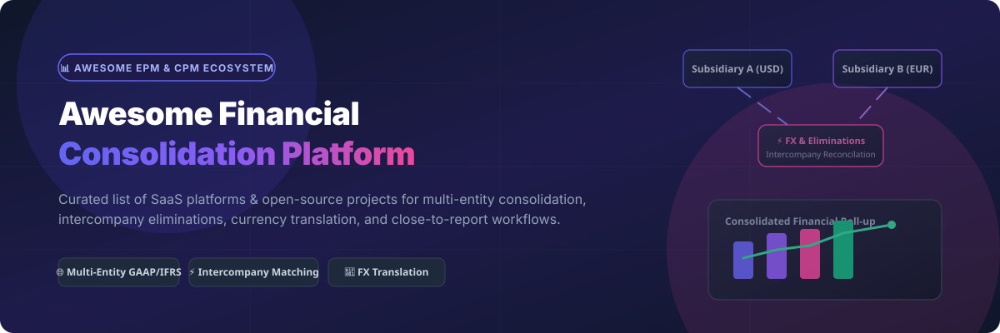

<p align="center">
  
</p>

<p align="center">
  <a href="https://github.com/ishandutta2007/Awesome-Awesome-Awesome"></a><a href="https://discord.gg/jc4xtF58Ve"></a>
  <a href="https://github.com/ishandutta2007/Awesome-Financial-Consolidation-Platform/stargazers"></a>
  <a href="https://github.com/ishandutta2007/Awesome-Financial-Consolidation-Platform/network/members"></a>
  <a href="https://github.com/ishandutta2007/Awesome-Financial-Consolidation-Platform/blob/main/LICENSE"></a>
  <a href="https://github.com/ishandutta2007"></a>
</p>

---

# 🏢 Awesome Financial Consolidation Platform 📊

> **A curated directory of top-tier Commercial SaaS platforms and Open-Source software for Multi-Entity Financial Consolidation, Corporate Performance Management (CPM/EPM), Intercompany Eliminations, FX Currency Translation, and GAAP/IFRS Group Close Reporting.**

---

## 📌 Table of Contents

- [🔍 Sector Overview & Market Dynamics](#-sector-overview--market-dynamics)
- [☁️ SaaS & Enterprise Commercial Platforms](#️-saas--enterprise-commercial-platforms)
- [🔓 Open-Source GitHub Projects](#-open-source-github-projects)
- [💡 Architectural Patterns for Custom Consolidation](#-architectural-patterns-for-custom-consolidation)
- [🤝 How to Contribute](#-how-to-contribute)
- [💖 Support & Sponsorship](#-support--sponsorship)
- [📈 Star History](#-star-history)
- [⚖️ Disclaimer](#️-disclaimer)

---

## 🔍 Sector Overview & Market Dynamics

📊 **Market Size & Structure Insights:**
- **Estimated Market Size:** The global Financial Consolidation and Corporate Performance Management (CPM) software market is valued at **$3.56 Billion – $3.80 Billion in 2026**, projected to expand to **$7.77 Billion – $12.80 Billion by 2035** (CAGR ~9% – 16.4%).
- **Market Structure:** The sector is **moderately concentrated at the enterprise top tier** (top 5 vendors—IBM, Oracle, SAP, Workiva, Wolters Kluwer CCH Tagetik—hold ~42% market share via ERP bundling and enterprise scale) and **highly fragmented in the mid-market** (where agile best-of-breed and cloud-native solutions compete for the remaining 58%).

---

## ☁️ SaaS & Enterprise Commercial Platforms

> *Commercial SaaS solutions sorted descending by Company Size (Annual Revenue / Valuation).*

| 🏢 Product / Platform | 📝 Description | 💼 Company Size (Revenue / Valuation) | 💵 Specific Pricing (Starting Tier) | 🎁 Free Tier / Free Trial Limits |
| :--- | :--- | :--- | :--- | :--- |
| **[IBM Planning Analytics](https://www.ibm.com/products/planning-analytics)** | TM1-based multidimensional modeling, financial consolidation, budgeting, and automated group reporting engine. | **Revenue:** ~$62.0B / **Valuation:** ~$210B (Public: IBM) | Starting at **$840/month** ($10,080/yr) for Cloud Standard tier or **$150/user/month** (min. 5 seats). | 🎁 **30-Day Free Trial** (up to 5 full user seats with pre-loaded models; no credit card required). |
| **[Oracle FCCS](https://www.oracle.com/epm/financial-consolidation-close/)** | Oracle EPM Cloud consolidation module with complex ownership structures, multi-GAAP rules, and native ERP integration. | **Revenue:** ~$53.0B / **Valuation:** ~$420B (Public: ORCL) | Starting at **$500/user/month** for Oracle EPM Enterprise Cloud (25-user minimum, **$12,500/mo** entry). | 🎁 **30-Day OCI Cloud Trial** ($300 cloud credits to test infrastructure & partner-guided EPM sandboxes). |
| **[SAP S/4HANA Group Reporting](https://www.sap.com/products/erp/s4hana-erp.html)** | Enterprise financial close & consolidation embedded in SAP S/4HANA for real-time transactional roll-ups. | **Revenue:** ~$35.2B (€31.2B) / **Valuation:** ~$260B (Public: SAP) | Starting at **$3,200/month** base enterprise ERP suite subscription or **$120/user/month**. | 🎁 **30-Day Guided Cloud Trial** (pre-configured SAP S/4HANA Group Reporting sandbox environment). |
| **[CCH Tagetik (Wolters Kluwer)](https://www.wolterskluwer.com/en/solutions/cch-tagetik)** | Corporate performance management suite with Smart Consolidation, complex ownership rules, and IFRS/GAAP disclosure controls. | **Revenue:** ~$6.2B (€5.6B) / **Valuation:** ~$36B (Public: WKL) | Starting at **$2,500/month** ($30,000/yr) base subscription plus **$80–$150/user/month** by module. | 🎁 **14-Day Sandbox Access** (sales-provisioned interactive demonstration environment upon qualification). |
| **[OneStream Software](https://www.onestream.com/)** | Unified intelligent finance platform combining multi-entity consolidation, close, planning, and reporting on a single data model. | **Revenue:** ~$600M / **Valuation:** ~$6.4B (Private / Acquired by Hg) | Starting at **$14,800/month** ($178,000/yr) base enterprise platform license for mid-market groups. | 🎁 **14 to 30-Day Guided POC** (no free-forever plan; custom sales-guided proof-of-concept workspace). |
| **[Workiva](https://www.workiva.com/)** | Connected reporting and compliance platform linking consolidated subsidiary data to SEC filings and board reporting. | **Revenue:** ~$630M / **Valuation:** ~$4.8B (Public: WK) | Starting at **$2,100/month** ($25,000/yr) base solution subscription for financial close & SEC modules. | 🎁 **14-Day Demo Workspace** (no permanent free tier; custom sales-provisioned sandbox demo upon request). |
| **[Lucanet](https://www.lucanet.com/)** | Financial consolidation and group reporting platform popular with mid-market international groups for GAAP/IFRS close. | **Revenue:** ~$130M / **Valuation:** ~$1.2B (Private / Hg Capital) | Starting at **$1,250/month** ($15,000/yr) for core mid-market consolidation tier with FX translation modules. | 🎁 **30-Day Free Trial** (full workspace trial with sample chart of accounts and Excel add-in access). |
| **[Prophix](https://www.prophix.com/)** | Mid-market corporate performance management solution covering consolidation, automated eliminations, and budgeting. | **Revenue:** ~$110M / **Valuation:** ~$850M (Private / Hg Capital) | Starting at **$1,000/month** ($12,000/yr) base platform subscription plus **$60/user/month**. | 🎁 **14-Day Interactive Test-Drive** (guided online software evaluation environment with pre-built models). |
| **[Board International](https://www.board.com/)** | Unified decision-making platform integrating financial consolidation, multi-entity planning, and business intelligence. | **Revenue:** ~$105M / **Valuation:** ~$800M (Private / Nordic Capital) | Starting at **$1,500/month** ($18,000/yr) base platform licensing fee plus user seat tiers. | 🎁 **30-Day Qualified Trial** (sales-assisted evaluation environment pre-loaded with consolidation rules). |
| **[Planful](https://planful.com/)** | Continuous financial planning and consolidation platform for mid-market and enterprise corporate finance teams. | **Revenue:** ~$85M / **Valuation:** ~$550M (Private / Vector Capital) | Starting at **$1,200/month** ($14,400/yr) for Planful Consolidation & Financial Close module package. | 🎁 **14-Day Partner Sandbox** (no free-forever plan; qualified proof-of-concept workspace via partner request). |
| **[Vena Solutions](https://www.venasolutions.com/)** | Excel-native financial consolidation and FP&A platform backed by a cloud-based audit database engine. | **Revenue:** ~$75M / **Valuation:** ~$450M (Private) | Starting at **$1,000/month** ($12,000/yr) base platform pricing for multi-entity reporting packages. | 🎁 **7-Day Interactive Tour & 14-Day Trial** (guided product tour and sales-assisted 14-day trial workspace). |
| **[Fluence Technologies](https://www.fluencetech.com/)** | Cloud-first financial consolidation software built specifically for mid-market groups with multi-ERP environments. | **Revenue:** ~$25M / **Valuation:** ~$160M (Private / Anaplan ecosystem) | Starting at **$850/month** ($10,200/yr) base pricing for close orchestration and elimination modules. | 🎁 **14-Day Guided Trial** (finance team evaluation environment with sample trial balance data importers). |

---

## 🔓 Open-Source GitHub Projects

> *Open-source tools, ERP modules, data transformation engines, and financial analytics frameworks sorted descending by GitHub Star Count.*

- **[Apache Superset](https://github.com/apache/superset)** [](https://github.com/apache/superset/stargazers)  
  ⚡ Enterprise-grade data visualization and business intelligence platform commonly deployed to present consolidated group financial balance sheets, income statements, and variance analysis.

- **[Odoo Multi-Company Accounting](https://github.com/odoo/odoo)** [](https://github.com/odoo/odoo/stargazers)  
  ⚡ Comprehensive open-source ERP offering multi-company charts of accounts, automatic intercompany transactions, currency revaluation, and consolidated group financial balance roll-ups.

- **[Metabase](https://github.com/metabase/metabase)** [](https://github.com/metabase/metabase/stargazers)  
  ⚡ Easy-to-use open-source BI dashboarding platform used by finance and operations teams to build real-time financial consolidation reports across entity data warehouses.

- **[ERPNext Multi-Company Consolidation](https://github.com/frappe/erpnext)** [](https://github.com/frappe/erpnext/stargazers)  
  ⚡ Fully open-source ERP framework with built-in consolidated financial statement generator, multi-currency ledger matching, and intercompany journal entries.

- **[Firefly III](https://github.com/firefly-iii/firefly-iii)** [](https://github.com/firefly-iii/firefly-iii/stargazers)  
  ⚡ Open-source personal and small-entity financial manager featuring multi-currency support, asset account tracking, and automated budget reconciliation.

- **[Cube Semantic Layer](https://github.com/cube-js/cube)** [](https://github.com/cube-js/cube/stargazers)  
  ⚡ Universal semantic layer for data warehouses to define consistent group KPIs, currency conversion formulas, and elimination metrics for downstream BI tools.

- **[dbt-core Warehouse Consolidation](https://github.com/dbt-labs/dbt-core)** [](https://github.com/dbt-labs/dbt-core/stargazers)  
  ⚡ Open transformation engine used to build auditable, version-controlled consolidation pipelines (intercompany eliminations, currency conversion, NCI) directly in cloud data warehouses.

- **[Akaunting](https://github.com/akaunting/akaunting)** [](https://github.com/akaunting/akaunting/stargazers)  
  ⚡ Modular open-source online accounting software built for small businesses and multi-entity tracking with multi-currency invoice & expense management.

- **[Invoice Ninja](https://github.com/invoiceninja/invoiceninja)** [](https://github.com/invoiceninja/invoiceninja/stargazers)  
  ⚡ Open-source invoicing, billing, and financial tracking solution with multi-company account switching and automated intercompany billing workflows.

- **[Beancount Plain-Text Accounting](https://github.com/beancount/beancount)** [](https://github.com/beancount/beancount/stargazers)  
  ⚡ Command-line double-entry accounting system with multi-currency tracking, custom financial modeling, and precise transaction roll-ups.

- **[Kill Bill](https://github.com/killbill/killbill)** [](https://github.com/killbill/killbill/stargazers)  
  ⚡ Open-source subscription billing and payment management platform supporting multi-tenant financial transaction routing and group revenue accounting.

- **[GnuCash](https://github.com/gnucash/gnucash)** [](https://github.com/gnucash/gnucash/stargazers)  
  ⚡ Desktop double-entry accounting software featuring multi-currency support, trial balance reports, and multi-entity account trees.

- **[Konsolidat (Open EPM Engine)](https://github.com/grynn-in/konsolidat)** [](https://github.com/grynn-in/konsolidat/stargazers)  
  ⚡ Dedicated open-source Enterprise Performance Management (EPM) engine focused explicitly on multi-entity consolidation (FX translation, intercompany elimination matrices, NCI, variance analysis).

---

## 💡 Architectural Patterns for Custom Consolidation

```
   ┌─────────────────────────────────────────────────────────────────┐
   │                  Subsidiary ERPs & General Ledgers              │
   │       (SAP / Oracle / NetSuite / Odoo / ERPNext / CSVs)         │
   └────────────────────────────────┬────────────────────────────────┘
                                    │ Extract Trial Balances
                                    ▼
   ┌─────────────────────────────────────────────────────────────────┐
   │                Cloud Data Warehouse (Snowflake / BigQuery)       │
   └────────────────────────────────┬────────────────────────────────┘
                                    │ Model via dbt-core / Konsolidat
                                    ▼
   ┌─────────────────────────────────────────────────────────────────┐
   │            Consolidation & Transformation Pipeline              │
   │  • FX Currency Conversion (IAS 21 / ASC 830)                    │
   │  • Intercompany Balances Elimination                            │
   │  • Non-Controlling Interest (NCI) & Minority Ownership          │
   └────────────────────────────────┬────────────────────────────────┘
                                    │ Serve via Cube Semantic Layer
                                    ▼
   ┌─────────────────────────────────────────────────────────────────┐
   │            Consolidated Group Reports & BI Dashboards           │
   │          (Apache Superset / Metabase / Excel / PowerBI)         │
   └─────────────────────────────────────────────────────────────────┘
```

---

## 🤝 How to Contribute

Contributions are warmly welcomed! Help us keep this directory accurate and updated:

1. 🍴 **Fork** this repository.
2. 📝 **Add or update** entries in `README.md` keeping descriptions factual and neutral.
3. 🔍 Ensure SaaS additions include starting tier pricing, free trial limits, and company revenue/valuation estimates.
4. 🚀 **Submit a Pull Request** with a brief summary of changes.

---

## 💖 Support & Sponsorship

Thank you for exploring this curated ecosystem guide for financial consolidation platforms! If you find this repository valuable, please consider:
- ⭐️ **Starring** the repository on GitHub
- 🍴 **Forking** it to customize for your enterprise setup
- 📢 **Sharing** with group controllers, CPM consultants, and open-source finance technologists

If you'd like to support the ongoing research and maintenance of this list, you can sponsor via the GitHub Sponsor Dashboard:

<p align="center">
  <a href="https://github.com/sponsors/ishandutta2007"></a>
</p>

---

## 📈 Star History

[](https://star-history.dera.page/#ishandutta2007/Awesome-Financial-Consolidation-Platform&type=date&legend=top-left)

---

## ⚖️ Disclaimer

- This repository is a **community-curated list** for informational and educational purposes only.
- Financial consolidation involves complex statutory accounting (GAAP, IFRS, IAS 21, ASC 830). Incorrect eliminations or currency revaluations can lead to material financial misstatements. Always consult certified financial controllers and auditors before deploying custom accounting models.
- All product names, logos, and brands are property of their respective owners.

---

**Made with ❤️ for Group Controllers, Finance Technologists & Open-Source Enthusiasts.**
